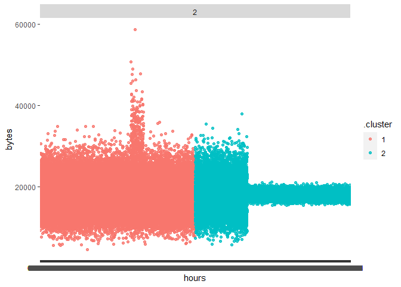
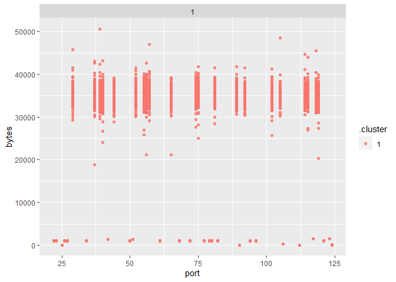

Сбор и аналитическая обработка информации о сетевом трафике
================
Тепсикоев С. А.

``` r
library(tidymodels)
library(arrow)
library(dplyr)
library(ggplot2)
```

#Задание 1: Надите утечку данных из Вашей сети Важнейшие документы с
результатми нашей исследовательской деятельности в области создания
вакцин скачиваются в виде больших заархивированных дампов. Один из
хостов в нашей сети используется для пересылки этой информации – он
пересылает гораздо больше информации на внешние ресурсы в Интернете, чем
остальные компьютеры нашей сети. Определите его IP-адрес.

##1. Импортируем датасет

``` r
knitr::opts_chunk$set(
  df_data <- arrow::read_csv_arrow("traffic_security.csv")
)
```

##2. Дадим имена признакам

``` r
knitr::opts_chunk$set(
  colnames(df_data) <- c('timestamp','src','dst','port','bytes')
)
head(df_data,3)
```

    # A tibble: 3 × 5
          timestamp src           dst           port bytes
            <int64> <chr>         <chr>        <int> <int>
    1 1578326400005 16.79.101.100 12.48.65.39     92 11895
    2 1578326400007 18.43.118.103 14.51.30.86     27   898
    3 1578326400011 15.71.108.118 14.50.119.33    57  7496

##3. Очистим датасет, оставив в src ip-адреса, только нашего предприятия

``` r
knitr::opts_chunk$set(
  df_data <- df_data[df_data$src > 11 & df_data$src < 15 & df_data$dst < 11 | df_data$dst > 15, ]
)
```

##4. Найдём ip-адрес и максимальное число передаваемых байтов(ответ кто
злоумышленник в организации)

``` r
knitr::opts_chunk$set(
 found_ip1 <- df_data %>%
            group_by(src) %>%
            summarise(bytes = mean(bytes)),
  found_ip1 <- found_ip1[which.max(found_ip1$bytes),],
  print(found_ip1) 
)
```

    # A tibble: 1 × 2
      src            bytes
      <chr>          <dbl>
    1 13.37.84.125 192390.

Ответ: 13.37.84.125

#Задание 2: Надите утечку данных 2 Другой атакующий установил
автоматическую задачу в системном планировщике cron для экспорта
содержимого внутренней wiki системы. Эта система генерирует большое
количество траффика в нерабочие часы, больше чем остальные хосты.
Определите IP этой системы. Известно, что ее IP адрес отличается от
нарушителя из предыдущей задачи

##1. Удаление IP из задания 1

``` r
knitr::opts_chunk$set(
  df_data <- df_data[!(df_data$src=="13.37.84.125"),]
)
head(df_data,3)
```

    # A tibble: 3 × 5
          timestamp src           dst          port bytes
            <int64> <chr>         <chr>       <int> <int>
    1 1578326400012 14.33.30.103  15.24.31.23   115 20979
    2 1578326400018 12.46.104.126 16.25.76.33   123  1500
    3 1578326400021 12.43.98.93   18.85.31.68    79   979

##2. Извлечение часов

``` r
knitr::opts_chunk$set(
  df_data$timestamp <- as.POSIXct(df_data$timestamp/1000, origin = "1970-01-01", tz = "GMT")
)
head(df_data,3) 
```

    # A tibble: 3 × 5
      timestamp           src           dst          port bytes
      <dttm>              <chr>         <chr>       <int> <int>
    1 2020-01-06 16:00:00 14.33.30.103  15.24.31.23   115 20979
    2 2020-01-06 16:00:00 12.46.104.126 16.25.76.33   123  1500
    3 2020-01-06 16:00:00 12.43.98.93   18.85.31.68    79   979

##3. Удаление NA

``` r
knitr::opts_chunk$set(
  df_data <- na.omit(df_data)
)
```

##4. Извлекаем часы и байты

``` r
knitr::opts_chunk$set(
  df_data_hours_bytes <- tibble(hours = format(as.POSIXct(df_data$timestamp), format = "%H%M%S"),
                                bytes = df_data$bytes)
)
head(df_data_hours_bytes,3)
```

    # A tibble: 3 × 2
      hours  bytes
      <chr>  <int>
    1 160000 20979
    2 160000  1500
    3 160000   979

##5. Разбиваем время на часы минуты и секунды

``` r
library("stringr") 
```


    Attaching package: 'stringr'

    The following object is masked from 'package:recipes':

        fixed

``` r
knitr::opts_chunk$set(
  df_data$hour <- with (df_data,format(as.POSIXct(df_data$timestamp), format = "%H")),
  df_data$minutes <- with (df_data,format(as.POSIXct(df_data$timestamp), format = "%M")),
  df_data$sec <- with (df_data,format(as.POSIXct(df_data$timestamp), format = "%S"))
)
head(df_data,3)
```

    # A tibble: 3 × 8
      timestamp           src           dst          port bytes hour  minutes sec  
      <dttm>              <chr>         <chr>       <int> <int> <chr> <chr>   <chr>
    1 2020-01-06 16:00:00 14.33.30.103  15.24.31.23   115 20979 16    00      00   
    2 2020-01-06 16:00:00 12.46.104.126 16.25.76.33   123  1500 16    00      00   
    3 2020-01-06 16:00:00 12.43.98.93   18.85.31.68    79   979 16    00      00   

##6. Группируем по времени

``` r
knitr::opts_chunk$set( 
df_data_hours_bytes <- df_data_hours_bytes %>%
            group_by(hours) %>%
            summarise(bytes = mean(bytes))
)
head(df_data_hours_bytes,3)
```

    # A tibble: 3 × 2
      hours   bytes
      <chr>   <dbl>
    1 000000 24886.
    2 000001 14100.
    3 000002 20128.

##7. Кластерезуем

``` r
knitr::opts_chunk$set(
  kclust <- kmeans(na.omit(df_data_hours_bytes), centers = 2)
)
```

##8. Эксперимент с кол-вом кластеров

``` r
knitr::opts_chunk$set(
  kclusts <-
    tibble(k = 2) %>%
    mutate(
      kclust = map(k, ~kmeans(df_data_hours_bytes, .x)),
      tidied = map(kclust, tidy),
      glanced = map(kclust, glance),
      augmented = map(kclust, augment, df_data_hours_bytes)
    )
)
```

``` r
knitr::opts_chunk$set(
  clusters <-
    kclusts %>%
    unnest(cols = c(tidied)),
  
  assigments <-
    kclusts %>%
    unnest(cols = c(augmented)),
    
  clusterings <-
    kclusts %>%
    unnest(cols = c(glanced))
)
```

##9. Графический вид

``` r
knitr::opts_chunk$set(
plot1 <-
  ggplot(assigments, aes(x = hours, y = bytes)) +
  geom_point(aes(color = .cluster), alpha = 0.8) +
  facet_wrap(~ k)
)
plot1
```



##10. Поиск IP в 07:20:30

``` r
knitr::opts_chunk$set(
df_data_hours_bytes <- df_data[df_data$hour=="07" & df_data$minutes=="20" & df_data$sec=="30",],

found_ip2 <- df_data_hours_bytes %>%
          group_by(src) %>%
          summarise(bytes = mean(bytes)),

found_ip2 <- found_ip2[which.max(found_ip2$bytes),]
)
print(found_ip2) 
```

    # A tibble: 1 × 2
      src           bytes
      <chr>         <dbl>
    1 12.55.77.96 656178.

Ответ: 12.55.77.96

#Задание 3: Надите утечку данных 3 Еще один нарушитель собирает
содержимое электронной почты и отправляет в Интернет используя порт,
который обычно используется для другого типа трафика. Атакующий
пересылает большое количество информации используя этот порт, которое
нехарактерно для других хостов, использующих этот номер порта.
Определите IP этой системы. Известно, что ее IP адрес отличается от
нарушителей из предыдущих задач.

##1. Удаление IP из задания 2

``` r
knitr::opts_chunk$set(
  df_data <- df_data[!(df_data$src=="12.55.77.96"),]
)
head(df_data,3)
```

    # A tibble: 3 × 8
      timestamp           src           dst          port bytes hour  minutes sec  
      <dttm>              <chr>         <chr>       <int> <int> <chr> <chr>   <chr>
    1 2020-01-06 16:00:00 14.33.30.103  15.24.31.23   115 20979 16    00      00   
    2 2020-01-06 16:00:00 12.46.104.126 16.25.76.33   123  1500 16    00      00   
    3 2020-01-06 16:00:00 12.43.98.93   18.85.31.68    79   979 16    00      00   

##2. Извлекаем часы и байты

``` r
knitr::opts_chunk$set(
  df_data_ports_bytes <- tibble(src = df_data$src,
                                port = df_data$port,
                                bytes = df_data$bytes)
  
)
head(df_data_ports_bytes,3)
```

    # A tibble: 3 × 3
      src            port bytes
      <chr>         <int> <int>
    1 14.33.30.103    115 20979
    2 12.46.104.126   123  1500
    3 12.43.98.93      79   979

##3. Группируем по портам

``` r
knitr::opts_chunk$set(
df_data_ports_bytes <- df_data_ports_bytes %>%
            group_by(src, port) %>%
            summarise(bytes = mean(bytes)),

df_data_ports_bytes <- tibble(port = df_data_ports_bytes$port,
                              bytes = df_data_ports_bytes$bytes)
)
```

    `summarise()` has grouped output by 'src'. You can override using the `.groups`
    argument.

``` r
head(df_data_ports_bytes,3)
```

    # A tibble: 3 × 2
       port bytes
      <int> <dbl>
    1    22  995.
    2    23 1000.
    3    25   42 

##4. Кластерезуем

``` r
knitr::opts_chunk$set(
  kclust <- kmeans(na.omit(df_data_ports_bytes), centers = 2)
)
```

##5. Эксперимент с кол-вом кластеров

``` r
knitr::opts_chunk$set(
  kclusts <-
    tibble(k = 1) %>%
    mutate(
      kclust = map(k, ~kmeans(df_data_ports_bytes, .x)),
      tidied = map(kclust, tidy),
      glanced = map(kclust, glance),
      augmented = map(kclust, augment, df_data_ports_bytes)
    )
)
```

``` r
knitr::opts_chunk$set(
  clusters <-
    kclusts %>%
    unnest(cols = c(tidied)),
  
  assigments <-
    kclusts %>%
    unnest(cols = c(augmented)),
    
  clusterings <-
    kclusts %>%
    unnest(cols = c(glanced))
)
```

##6. Графический вид

``` r
knitr::opts_chunk$set(
plot1 <-
  ggplot(assigments, aes(x = port, y = bytes)) +
  geom_point(aes(color = .cluster), alpha = 0.8) +
  facet_wrap(~ k)
)
plot1
```



##7. Поиск IP по 39 порту

``` r
knitr::opts_chunk$set(
df_data_ports_bytes <- tibble(src = df_data$src,
                              port = df_data$port,
                              bytes = df_data$bytes),

df_data_ports_bytes <- df_data_ports_bytes %>%
            group_by(src, port) %>%
            summarise(bytes = mean(bytes)),

df_data_ports_bytes <- df_data_ports_bytes[df_data_ports_bytes$port=="39",],

found_ip3 <- df_data_ports_bytes %>%
          group_by(src, port) %>%
          summarise(bytes = mean(bytes)),

found_ip3 <- found_ip3[which.max(found_ip3$bytes),]
)
```

    `summarise()` has grouped output by 'src'. You can override using the `.groups`
    argument.
    `summarise()` has grouped output by 'src'. You can override using the `.groups`
    argument.

``` r
print(found_ip3) 
```

    # A tibble: 1 × 3
    # Groups:   src [1]
      src           port  bytes
      <chr>        <int>  <dbl>
    1 13.36.102.77    39 50597.

Ответ: 13.36.102.77
